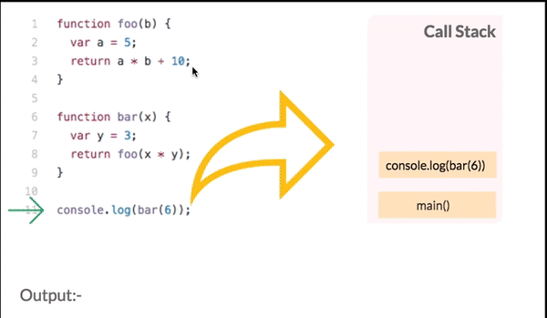
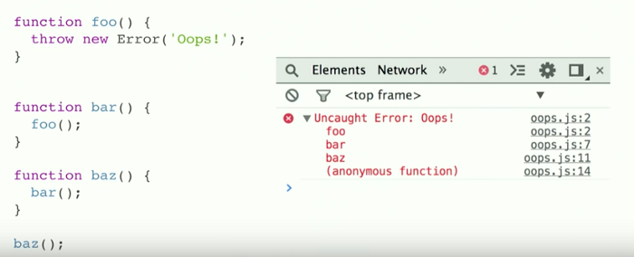
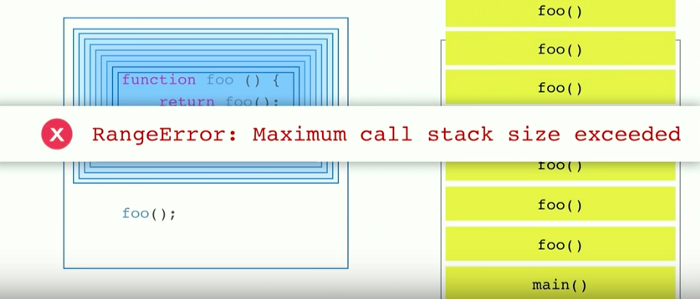
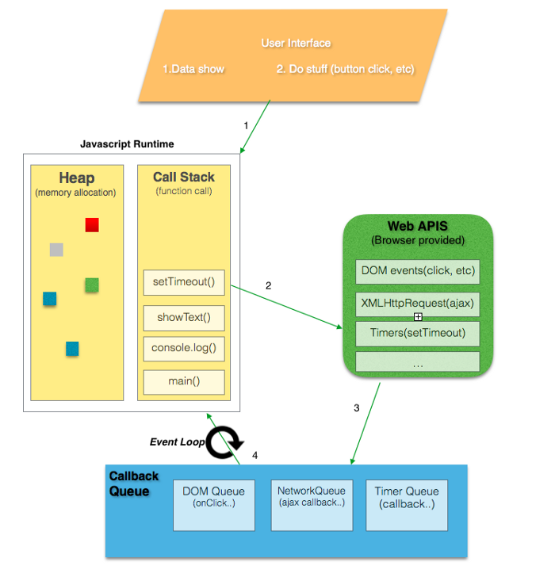

자바스크립트는 하나의 스레드에 단 1개의 동시성만 다루는 언어이다. 이것이 의미하는 것은 자바스크립트가 한번에 1개의 작업만 다룰 수 있는 것을 의미한다. 자바스크립트는 힙, 큐와 함께 자바스크립트 동시성 모델을 구성하는 단일 콜스택을 가진다.


[Visual Representation of JS Model(credits)](https://developer.mozilla.org/en-US/docs/Web/JavaScript/EventLoop)

# 1. 콜 스택

함수의 호출을 기록하는 자료구조이며 기본적으로 우리가 프로그램 안에서 위치한 곳이다. 만약, 우리가 어떤 함수를 실행시킨다면, 우리는 스택 위에 무언가를 올리는(push) 행위를 하는것이며 우리가 함수로부터 반환을 받을 때, 우리는 스택의 맨 위를 가져오는(pop) 것이다.



우리가 위의 파일을 실행시키면서 우리가 처음으로 하는 일은 모든 실행이 시작되는 메인 함수를 찾는 일이다. 위에서는 `console.log(bar(6));` 가 먼저 콜스택에 올라가게 된다. 그 이후에는 bar 함수가 매개변수들과 같이 스택의 top으로 올라가게 되고 `foo` 함수는 스택의 top으로 올라갔다가 곧장 값을 반환하고 빠지게(pop) 된다. 그 다음에는 `bar` 함수와 `console.log(bar(6));` 구문이 차례로 빠지게 된다. 그리고 마침내 `console.log(bar(6));` 구문은 값을 출력하게 된다. 이 모든 것들은 순식간에 (ms 단위) 처리된다.

브라우저 콘솔에서 가끔 긴 빨간색 에러 스택들을 본기억이 있을 것이다. 보통 그것들은 콜스택의 현재 상태를 나타낸다. 그리고 실패한 함수를 스택처럼 top 부터 bottom 까지 나타내는 것이다.



[Error stack trace(credits)](https://www.youtube.com/watch?v=8aGhZQkoFbQ)

가끔 우리는 함수를 재귀적으로 여러번 부르다가 무한 루프에 빠지게 된다. 크롬 브라우저는 16000 프레임의 제한된 스택을 가지고 있어서 이 범위를 넘어서게 된다면 Max Stack Error Reached 라는 상태가 되고 실행 중이던 것을 죽인다.



[(credits)](https://www.youtube.com/watch?v=8aGhZQkoFbQ)

# 2. 힙

오브젝트(객체)들은 힙 내부에 할당된다. 힙은 거의 구조화되지 않은 영역의 메모리이다. 변수와 객체들의 모든 메모리 할당은 이곳에서 일어난다.

# 3. 큐

자바스크립트 런타임은 메시지 큐를 가지고 있다. 메시지 큐는 실행될 콜백함수나 실행될 메시지들의 리스트이다. 스택이 충분한 공간을 가지고 있을 때, 메세지는 큐 밖으로 나오게 되고 메시지가 가지고 있던 함수 목록들이 실행된다. 이렇게 초기 스택 프레임이 만들어진다. 스택이 다시 빌 때, 메시지 처리도 끝이 난다. 기본적으로, 이러한 메세지는 콜백함수가 등록된 경우 외부 비동기 이벤트 (마우스 클릭 또는 HTTP 요청에 대한 응답 수신)에 대한 응답으로 대기한다. 만약, 사용자가 콜백함수가 등록되지 않은 버튼을 클릭하는 경우 메시지 큐에 메시지가 추가되지 않는다.

# 4. 이벤트 루프

기본적으로 자바스크립트 코드의 성능을 측정할 때, 스택 안의 함수들은 성능를 느리거나 빠르게 만든다. `console.log()` 는 빠르지만 수천 수백만개가 넘는 `for문` 또는 `while문`과 같은 반복문을 수행한다면 코드는 매우 느릴 것이며 스택을 계속 차지하고 있을 것이다. 이것을 `"blocking script"` 라고 부른다.

네트워크 요청 또는 이미지 요청은 느릴 수 있다. 다행스럽게도 비동기 함수인 AJAX를 통해 서버 요청을 할 수 있다. 만약 이러한 네트워크 요청들이 동기 함수를 통해서 이루어진다고 가정해보자. 먼저 컴퓨터가 네트워크 요청을 받는다면 그 요청은 또 다른 컴퓨터나 기계와 같은 어떤 서버로 갈 것이다. 네트워크 응답은 응답자의 사정에 따라 매우 느려질 수 있다. 그 동안, 만약 `CTA(Call To Action)` 버튼이나 렌더링이 필요한 무언가를 클릭한다면 스택이 막혀있기 때문에 어떠한 반응도 일어나지 않을 것이다. 루비와 같은 멀티 스레드 언어에서는 이러한 일도 잘 해결될 수 있지만, 싱글 스레드 언어인 자바스크립트는 스택에 쌓인 함수들에서 어떠한 값을 반환하기 전까지는 불가능하다. 그 웹페이지는 브라우저가 아무 것도 할 수 없기 때문에 완전히 망가질 것이다. 우리가 엔드 유저를 위해 유동적인 UI를 원한다면 이러한 방법은 이상적이지 않다.

이러한 문제를 해결하는 가장 쉬운 방법은 비동기 콜백을 사용하는 것이다. 비동기 콜백을 사용한다는 것은 코드의 일부를 실행하고 나중에 실행할 콜백을 등록하는 것을 말한다. 우리는 개발을 하면서 AJAX와 같은 비동기형 콜백 `($.get(), setTimeout(), setInterval(), Promises, etc...)` 을 마주하게 된다. 모든 비동기 콜백들은 즉시 실행되지 않고 나중에 실행되므로 `console.log(), mathematical operations` 와 같은 동기 함수와 달리 스택 내부로 push 될 수 없다.

:::tip
**"Concurrency in JS— One Thing at a Time, except not Really, Async Callbacks"**
:::

```html
<!DOCTYPE html>
<html>
  <body>
    <div id="demo">
      <h1>The XMLHttpRequest Object</h1>
      <button type="button" onclick="loadDoc()">Change Content</button>
    </div>
  </body>
  <script>
    function loadDoc() {
      var xhttp = new XMLHttpRequest();
      xhttp.onreadystatechange = function() {
        if (this.readyState === 4 && this.status === 200) {
          console.log(this.responseText);
        }
      };
      xhttp.open('GET', 'ajax_info.txt', true);
      xhttp.send();
      console.log('Script call done');
    }
  </script>
</html>

<!--
Script call done
<h1>AJAX</h1>
<p>AJAX is not a programming language</p>
<p>AJAX is a technique for accessing web servers from a web page.</p>
<p>AJAX stands for Asyncronous JavaScript And XML.</p>
-->
```

1. 요청 함수가 실행되고 나중에 응답이 올 때 실행 될 익명 함수를 `onreadystatechange` 이벤트에 콜백으로 전달한다.
2. `Script call done` 은 즉시 콘솔에 출력된다.
3. 나중에 응답이 오고 콜백이 실행 될 때 본문이 콘솔에 출력된다.



응답(response)에서 호출자(caller)를 분리하면 자바스크립트 런타임이 비동기 작업이 완료되고 해당 콜백이 실행되기를 기다리는 동안 다른 작업을 수행 할 수 있다.
`2` 여기에서는 브라우저 API들이 작동한다. DOM 이벤트, http 요청, setTimeout 등과 같은 비동기 이벤트를 처리하기 위해 브라우저 내부에 C++로 구현된 코드들에 의해 만들어진 기본적인 스레드들(threads)의 API를 호출한다.

:::tip
DOM 이벤트, http 요청, setTimeout 등과 같은 비동기 이벤트를 처리하기 위한 브라우저 웹 API 스레드들은 브라우저 내부에 C++로 구현되어있다.
:::

이러한 Web API들은 스스로 자신들의 실행코드를 스택에 넣을 수 없다. 만약 스스로 자신들의 실행코드를 스택에 넣을 수 있다면, 우리의 코드 중간에 무작위로 나타날 것이다. 위에서 다뤄진 메시지 콜백 큐가 이것을 증명한다.
`3` WebAPI는 실행이 완료되면 큐에 콜백을 푸시한다. 이벤트 루프는 큐에 있는 콜백들을 실행하고 스택이 비어있을때 스택에 넣는 역할을 한다. 이벤트 루프의 기본 작업은 스택과 작업 큐를 보고 스택이 비어있을 때 큐의 첫번째 콜백을 스택에 푸시하는 것이다. 각 메시지 또는 콜백은 다른 메시지가 처리되기 전에 완전히 처리된다.

```javascript
while (queue.waitForMessage()) {
  queue.processNextMessage();
}
```

메시지들은 웹 브라우저에서 언제든 이벤트가 발생했을 때 추가되며 이벤트들에는 이벤트 리스너가 붙어있다. 만일 리스너가 없다면 발생한 이벤트는 그냥 사라진다. 언제든 우리가 웹 브라우저에서 어떤 요소를 클릭했을 때, 클릭 이벤트 핸들러는 큐에 메시지를 추가한다. 웹브라우저의 다른 이벤트들도 동일하다. 이러한 콜백 함수 호출은 콜스택 안에서 초기 프레임의 역할을 한다. 자바스크립트는 싱글스레드이기 때문에, 추가적인 폴링 중 메시지와 프로세싱은 잠시 중단되고 스택에 있는 모든 호출들의 return을 기다린다. 그리고 동기 함수들은 스택에 새로운 콜 프레임들을 추가한다.

# References

[자바스크립트 개발자라면 알아야 할 33가지 개념 #1 콜스택 (번역)](https://velog.io/@jakeseo_me/2019-03-15-2303-%EC%9E%91%EC%84%B1%EB%90%A8-rmjta5a3xh)
