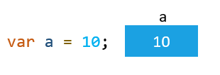
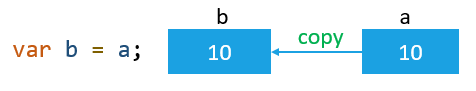
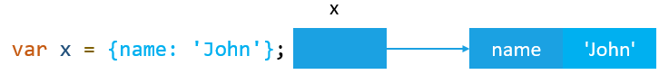
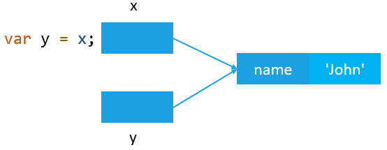
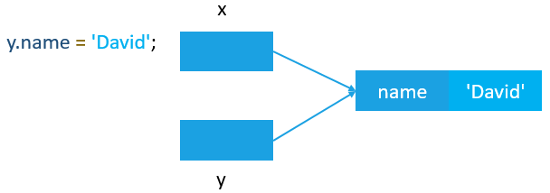

# 3. Value Types and Reference Types

자바스크립트에서는 변수를 원시 및 참조의 두 가지 타입으로 저장할 수 있다.

- 원시 타입
  - undefined
  - null
  - boolean
  - number
  - string
  - symbol
- 참조 타입
  - object

원시 값은 고정된 크기를 가지며, `스택` 에 저장한다.  
참조 값은 동적인 크기를 가지며, 참조 값은 `힙` 에 저장한다.

변수에 값을 할당할 때, 자바스크립트 엔진은 해당 값이 원시 값인지 참조 값인지를 결정한다.

만약 값이 원시 값인 경우, 변수에 접근할 때 변수에 저장된 `실제 값` 을 조작한다. 즉, 원시 값을 저장하는 변수는 `값으로 접근` 한다.
원시 값과 달리, 객체를 조작할 때는 실제 객체가 아닌 해당 객체에 대한 `참조` 를 조작한다. 이는 객체를 저장하는 변수는 `참조로 접근` 한다는 것을 의미한다.

원시 값의 타입을 확인하기 위해 `typeof 연산자` 를 사용한다.

```javascript
let x = 10;
console.log(typeof x); // number
```

```javascript
let str = 'JS';
console.log(typeof str); // string
```

참조 값의 타입을 확인하기 위해 `instanceof 연산자` 를 사용한다.

```javascript
let rgb = ['red','green','blue'];
console.log(rgb instanceof Array); // true
```

## 원소 값 복사

원소 값이 저장된 변수를 다른 변수에 할당할 때, 변수에 저장된 값이 생성되어 새로운 변수로 복사된다.

`a` 변수를 선언하고 10으로 초기화한다.

```javascript
var a = 10;
```



`b` 변수를 선언하고 `a` 변수의 값을 `b` 변수에 할당한다. 자바스크립트 엔진은 내부적으로 `a`에 저장된 값을 `b` 의 위치로 복사한다.

```javascript
var b = a;
```

`b` 변수에 새로운 값 20을 할당한다.



변수 `a` 와 변수 `b` 는 아무 관계가 없기 때문에, 변수 `b` 에 저장된 값이 변경될 때, 변수 `a` 의 값은 변경되지 않는다.

```javascript
b = 20;
```


```javascript
console.log(a); // 10
console.log(b); // 20
```

## 참조 값 복사

한 변수에서 다른 변수로 참조 값을 할당하면, 변수에 저장된 값 또한 새 변수의 위치로 복사된다.

원소 값 복사와 다른 점은 두 변수에 저장된 값이 힙에 저장된 실젝 객체의 주소라는 점이다. 결과적으로 두 변수는 같은 객체를 참조한다.

```javascript
var x = {
  name: 'john'
};
```



`y` 변수를 선언하고 `x` 변수를 `y` 변수에 할당한다. 이제 `x` 변수와 `y` 변수는 같은 객체를 참조한다.

```javascript
var y = x;
```



```javascript
y.name = 'David';
```



```javascript
console.log(x.name); // 'David'
```


# References

[JavaScript Primitive vs. Reference Values](https://www.javascripttutorial.net/javascript-primitive-vs-reference-values/)
